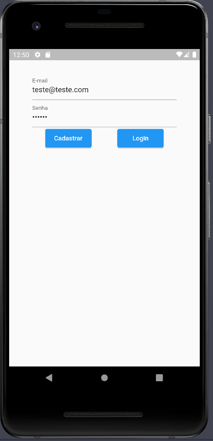
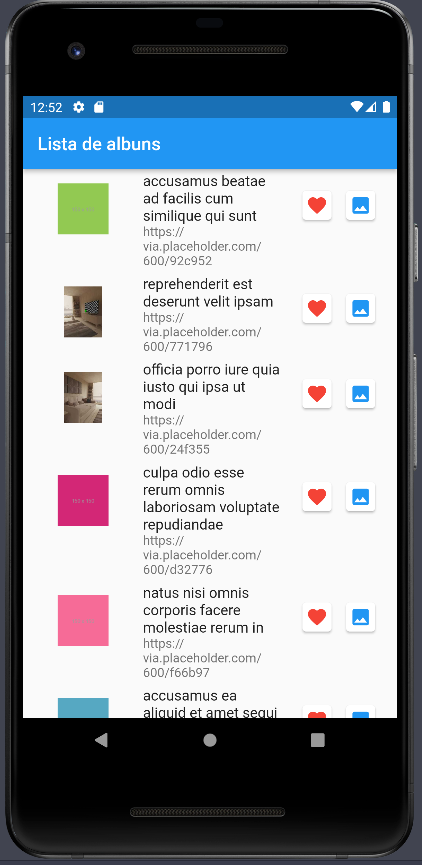

# Aplicativo Listagem De Álbuns
Aplicativo sem uso específico, feito para pós graduação, para aprendizado de tecnologias do Firebase, testes e melhor organização do projeto em si.

## Tecnologias utilizadas

- Realtime Database
- Firebase Authentication
- Firebase Storage
- Testes Unitários
- Testes de Widgets

## Prints da aplicação:

